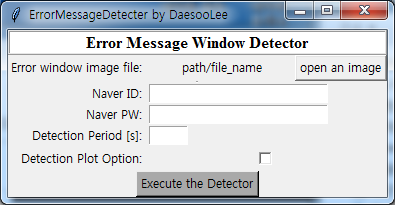
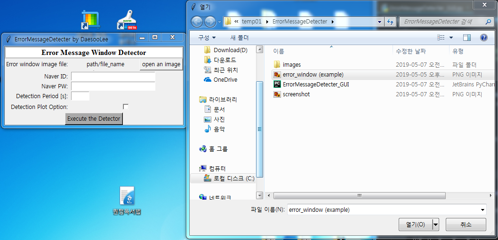
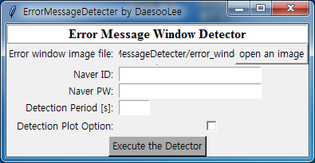
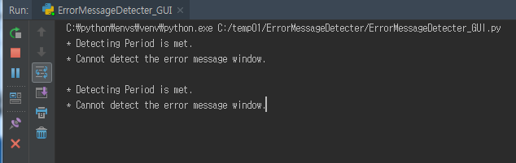
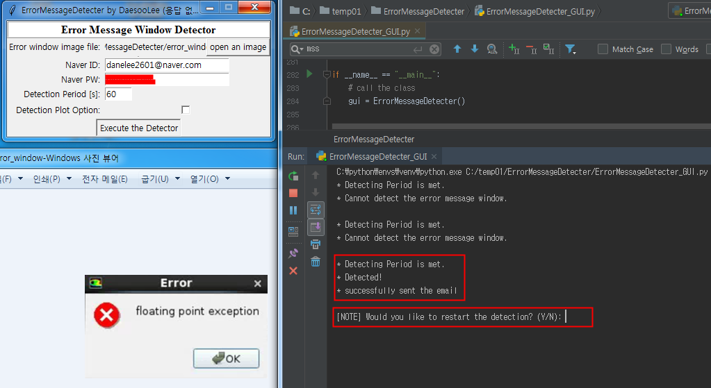
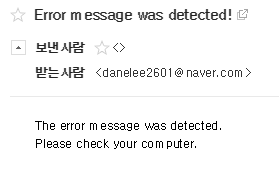

# Description
 It detects an error message (pop-up window), and notifies the user by email.  
 Initially made to detect an error message pop-up window during simulation in the commercial software "ANSYS-FLUENT".  
 Howver, later it was developed expanding its use to detect any popup window message for a general use.  
  
 For the convience of use, it is made in a GUI form. 
 
# Dependency (Names of Libraries)
  tkinter, numpy, matplotlib, cv2
  
# Quick Start
<b>Two things to do in advance</b>  
(a) Allow the SMTP use in the naver mail to send an email with python: https://qkqhxla1.tistory.com/804  
(b) Download the naver mail app on your phone: http://blog.naver.com/PostView.nhn? blogId=wldms3512&logNo=220567926748&parentCategoryNo=&categoryNo=21&viewDate=&isShowPopularPosts=true&from=search  

 

  
1. If you execute 'ErrorMessageDetecter_GUI.py', you will see this window.  

  
2. Click 'open an image', and choose the error message image

  

  

  

  

  
