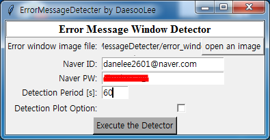

# Description
 It detects an error message (pop-up window), and notifies the user by email.  
 Initially made to detect an error message pop-up window during simulation in the commercial software "ANSYS-FLUENT".  
 Howver, later it was developed expanding its use to detect any popup window message for a general use.  
  
 For the convience of use, it is made in a GUI form. 
 
# Dependency (Names of Libraries)
  tkinter, numpy, matplotlib, cv2
  
# Quick Start
<b>[NOTE] Two three to do in advance (These are simple. No worries.)</b>  
(a) Allow the SMTP use in the naver mail to send an email with python: https://qkqhxla1.tistory.com/804  
(b) Download the naver mail app on your phone: http://blog.naver.com/PostView.nhn? blogId=wldms3512&logNo=220567926748&parentCategoryNo=&categoryNo=21&viewDate=&isShowPopularPosts=true&from=search  
(c) Get an image file of the error message of yours. (you can use the snipping tool(=캡쳐도구)) (NOTE: Don't change the scale of the image!)  

 

  
1. If you execute 'ErrorMessageDetecter_GUI.py', you will see this window.   

  
2. Click 'open an image', and choose the image of the error message.   

  
3. It's the window with the image file uploaded.   

  
4. Type your Naver id, password and detection period (= how often you want the detecter to detect.) [in seconds]  
(FYI. If 'Detection Plot Option' is checked, when the error message is detected, the program will show where it finds the message by a red square. But you don't have to check it. Not necessary at all.)   

  
5. The Detecter is running ...   

  
6. if the detecter finds the error message, it prints "Detected!" and sends a notification email to your Naver email account.   

  
7. The notification email.   
 
 

<i>
Made by Daesoo Lee (이대수), Masters, Korea Maritime and Ocean University (한국해양대학교) 
e-mail : daesoolee@kmou.ac.kr 
First made on 04/14/2019  

Made for 울산대학교 천이난류유동연구실
</i>

